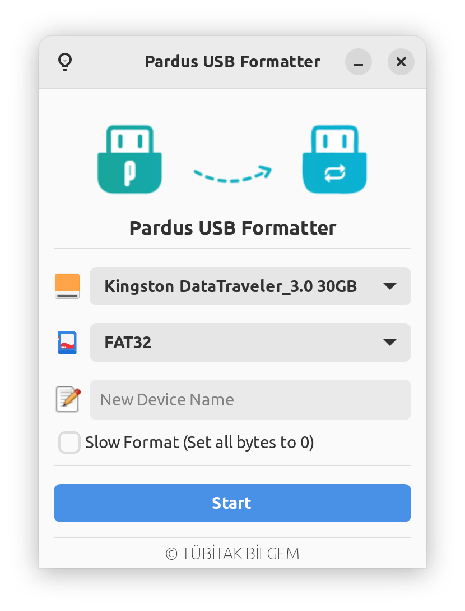

# Pardus Usb Formatter

Pardus Usb Formatter is an application for format USB drives easily.

It is currently a work in progress. Maintenance is done by <a href="https://www.pardus.org.tr/">Pardus</a> team.

[](https://repology.org/project/pardus-usb-formatter/versions)

### **Dependencies**

This application is developed based on Python3 and GTK+ 3. Dependencies:
```bash
gir1.2-glib-2.0 gir1.2-gtk-3.0 python3-gi python3-pyudev
```

### **Run Application from Source**

Install dependencies
```bash
sudo apt install gir1.2-glib-2.0 gir1.2-gtk-3.0 python3-gi python3-pyudev
```
Clone the repository
```bash
git clone https://github.com/pardus/pardus-usb-formatter.git ~/pardus-usb-formatter
```
Run application
```bash
python3 ~/pardus-usb-formatter/src/Main.py
```

### **Build deb package**

```bash
sudo apt install devscripts git-buildpackage
sudo mk-build-deps -ir
gbp buildpackage --git-export-dir=/tmp/build/pardus-usb-formatter -us -uc
```

### **Screenshots**



